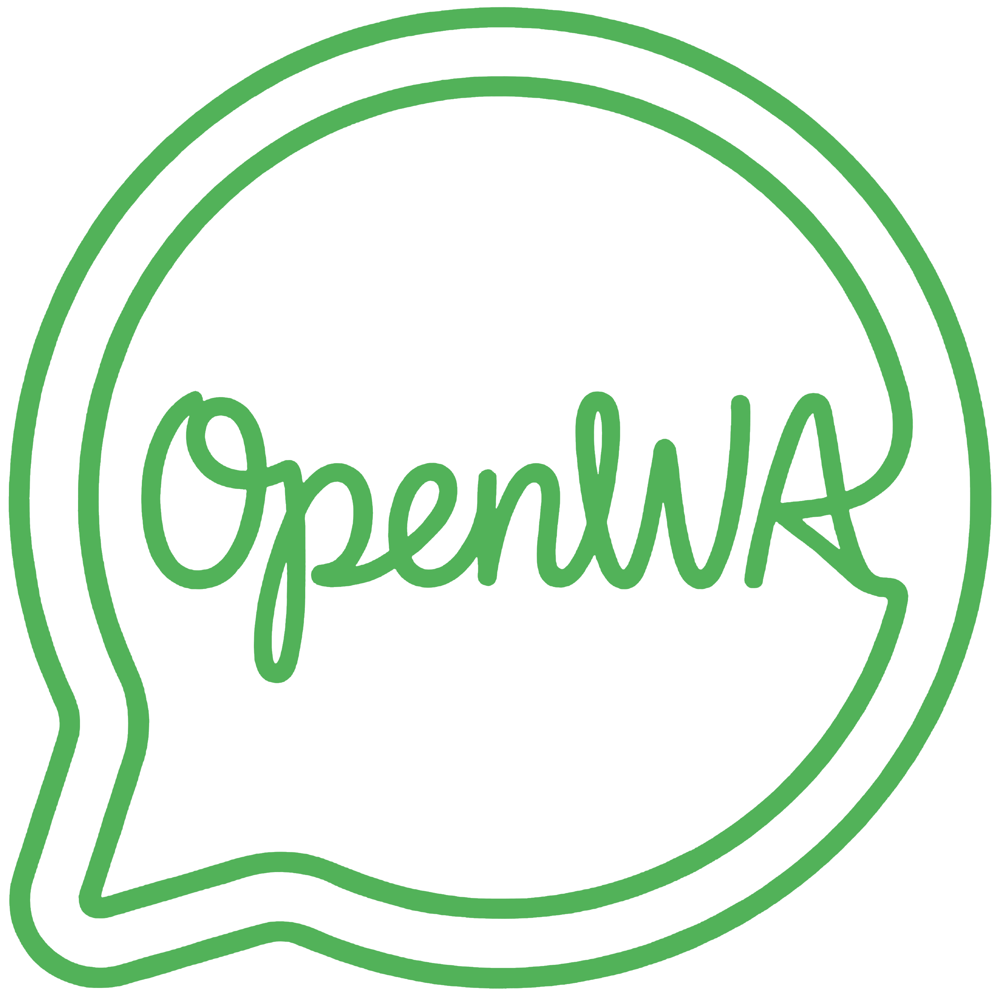

<p align="center">
  
</p>

# ioBroker.openwa

[](https://www.npmjs.com/package/iobroker.openwa)
[](https://www.npmjs.com/package/iobroker.openwa)


[](https://nodei.co/npm/iobroker.openwa/)

**Tests:** 

---

## ioBroker Adapter für Open-WA (WhatsApp)

Dieser Adapter verbindet **ioBroker** mit einer laufenden [Open-WA](https://github.com/rmyndharis/OpenWA)-Instanz und ermöglicht das Senden von WhatsApp-Nachrichten direkt aus Blockly-Skripten, JavaScript-Skripten und Automationen heraus.

> **Disclaimer:** Dieser Adapter ist kein offizielles Produkt von WhatsApp oder Meta. Die Nutzung erfolgt auf eigene Verantwortung und muss den [WhatsApp Terms of Service](https://www.whatsapp.com/legal/terms-of-service) entsprechen. „WhatsApp" ist eine eingetragene Marke von Meta Platforms, Inc.

---

## Inhaltsverzeichnis

- [Voraussetzungen](#voraussetzungen)
- [Installation](#installation)
- [Konfiguration](#konfiguration)
- [Verwendung](#verwendung)
  - [Blockly](#blockly)
  - [JavaScript / Skript-Adapter](#javascript--skript-adapter)
- [Nachrichtentypen](#nachrichtentypen)
- [Datenpunkte](#datenpunkte)
- [Changelog](#changelog)
- [Lizenz](#lizenz)

---

## Voraussetzungen

- **ioBroker** mit `js-controller >= 6.0.11` und `admin >= 7.0.23`
- **Node.js >= 22**
- Eine laufende **Open-WA**-Instanz mit aktivierter REST-API und einem API-Token
  - Open-WA muss über HTTP erreichbar sein (z. B. `http://192.168.1.x:2785`)
  - Es muss mindestens eine WhatsApp-Session aktiv und eingeloggt sein

---

## Installation

Den Adapter über die **ioBroker Admin-Oberfläche** installieren:

1. Admin → Adapter → Suche nach `openwa`
2. Auf „Installieren" klicken
3. Eine neue Instanz anlegen

Alternativ per npm:

```bash
npm install iobroker.openwa
```

---

## Konfiguration

Nach der Installation die Adapterinstanz öffnen. Es sind drei Felder auszufüllen:

| Feld | Beschreibung | Beispiel |
|---|---|---|
| **Open-WA Server URL** | Vollständige URL inkl. Port zur Open-WA REST-API | `http://192.168.1.100:2785` |
| **API Token** | Der API-Schlüssel der Open-WA-Instanz (wird verschlüsselt gespeichert) | `mein-geheimer-token` |
| **Session ID** | Die Session-ID der aktiven WhatsApp-Sitzung in Open-WA | `mySession` |

Nach dem Speichern versucht der Adapter automatisch, eine Verbindung zur Open-WA-API herzustellen. Der Verbindungsstatus ist am Datenpunkt `openwa.0.info.connection` sowie am grünen/roten Indikator in der Admin-Übersicht sichtbar.

---

## Verwendung

### Blockly

Der Adapter stellt einen eigenen **Blockly-Baustein** bereit. Dieser ist im Blockly-Editor unter **„Sendeto"** → **„WhatsApp (Open-WA)"** zu finden.

Der Baustein bietet folgende Einstellmöglichkeiten:

| Feld | Beschreibung |
|---|---|
| **Instanz** | Adapterinstanz (z. B. `openwa.0`) |
| **Chat-Typ** | `Privater Chat` oder `Gruppen Chat` |
| **Nachrichtentyp** | Text, Bild, Video, Audio/Sprache, Dokument |
| **Nachricht** | Der Nachrichtentext (bei Textnachrichten) |
| **ChatID** | Telefonnummer oder Gruppen-ID des Empfängers |
| **URL** | Öffentliche URL einer Mediendatei (optional, für Mediennachrichten) |
| **Base64 String** | Base64-kodierte Mediendatei (optional, Alternative zur URL) |
| **MIME-Type** | Medientyp der Datei (oder `auto` für automatische Erkennung) |
| **Caption** | Bildunterschrift für Bild-/Videonachrichten (optional) |
| **Ergebnis in** | Variable, in der das Sendeergebnis gespeichert wird |

**Hinweis zur ChatID:**
- Für private Chats: Telefonnummer im internationalen Format ohne `+` und ohne Leerzeichen, z. B. `4915112345678`
- Für Gruppen: Die interne WhatsApp-Gruppen-ID, z. B. `123456789-1620000000`
- `@c.us` bzw. `@g.us` werden automatisch angehängt, falls nicht vorhanden.

---

### JavaScript / Skript-Adapter

Nachrichten können auch direkt per `sendTo` aus JavaScript-Skripten gesendet werden:

**Textnachricht:**

```javascript
sendTo('openwa.0', 'send', {
    to: '4915112345678',
    text: 'Hallo aus ioBroker!',
    type: 'private'   // 'private' oder 'group'
}, result => {
    const res = JSON.parse(result);
    if (res.success) {
        console.log('Nachricht gesendet, ID: ' + res.id);
    } else {
        console.error('Fehler: ' + JSON.stringify(res.error));
    }
});
```

**Bildnachricht per URL:**

```javascript
sendTo('openwa.0', 'send', {
    to: '4915112345678',
    type: 'private',
    msgType: 'image',
    url: 'https://example.com/bild.jpg',
    caption: 'Das ist ein Bild'
}, result => {
    console.log(result);
});
```

**Bildnachricht per Base64:**

```javascript
sendTo('openwa.0', 'send', {
    to: '4915112345678',
    type: 'private',
    msgType: 'image',
    base64: '<BASE64_STRING>',
    mimeType: 'image/jpeg',
    caption: 'Kamerabild'
}, result => {
    console.log(result);
});
```

---

## Nachrichtentypen

| `msgType` | Beschreibung | Benötigte Felder |
|---|---|---|
| `text` | Einfache Textnachricht | `text` |
| `image` | Bild (JPEG, PNG, WebP) | `url` oder `base64`, optional `caption` |
| `video` | Videodatei (MP4) | `url` oder `base64`, optional `caption` |
| `audio` | Audiodatei / Sprachnachricht (MP3, OGG) | `url` oder `base64` |
| `document` | Beliebige Datei als Dokument (z. B. PDF) | `url` oder `base64` |

**Rückgabewert (`result`):**

```json
{
  "success": true,
  "status": 200,
  "id": "ABCDEF1234567890",
  "timestamp": 1716000000
}
```

Im Fehlerfall:

```json
{
  "success": false,
  "status": 401,
  "error": { ... }
}
```

---

## Datenpunkte

| Datenpunkt | Typ | Beschreibung |
|---|---|---|
| `openwa.0.info.connection` | `boolean` | `true` wenn die Verbindung zur Open-WA-API aktiv ist |

---

## Changelog

### 0.0.1 (2026-05-22)
* (Thorsten Böttler) Erstveröffentlichung
* Senden von Text-, Bild-, Video-, Audio- und Dokumentnachrichten
* Blockly-Integration mit vollständigem Baustein
* Verschlüsselte Speicherung des API-Tokens
* Verbindungsstatusanzeige über `info.connection`

---

## Lizenz

MIT License

Copyright (c) 2026 Thorsten Böttler <thorsten.boettler@freenet.de>

Permission is hereby granted, free of charge, to any person obtaining a copy
of this software and associated documentation files (the "Software"), to deal
in the Software without restriction, including without limitation the rights
to use, copy, modify, merge, publish, distribute, sublicense, and/or sell
copies of the Software, and to permit persons to whom the Software is
furnished to do so, subject to the following conditions:

The above copyright notice and this permission notice shall be included in all
copies or substantial portions of the Software.

THE SOFTWARE IS PROVIDED "AS IS", WITHOUT WARRANTY OF ANY KIND, EXPRESS OR
IMPLIED, INCLUDING BUT NOT LIMITED TO THE WARRANTIES OF MERCHANTABILITY,
FITNESS FOR A PARTICULAR PURPOSE AND NONINFRINGEMENT. IN NO EVENT SHALL THE
AUTHORS OR COPYRIGHT HOLDERS BE LIABLE FOR ANY CLAIM, DAMAGES OR OTHER
LIABILITY, WHETHER IN AN ACTION OF CONTRACT, TORT OR OTHERWISE, ARISING FROM,
OUT OF OR IN CONNECTION WITH THE SOFTWARE OR THE USE OR OTHER DEALINGS IN THE
SOFTWARE.
